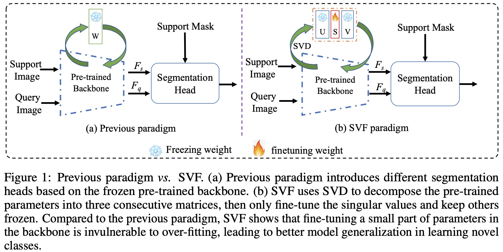

# Singular Value Fine-tuning: Few-shot Segmentation requires Few-parameters Fine-tuning

**Update**:
1. The manuscript has been accepted in __NeurIPS 2022__.
2. The core code is expected to be open source next week.
3. **Core code has been updated**
4. [torch code](https://github.com/zechao-li/SVF-pytorch) has been updated.

This is the official implementation based on paddlepaddle of the paper [Singular Value Fine-tuning: Few-shot Segmentation requires Few-parameters Fine-tuning](https://arxiv.org/pdf/2206.06122.pdf).

Authors: Yanpeng Sun^, Qiang Chen^, Xiangyu He^, Jian Wang, Haocheng Feng, Junyu Han, Errui Ding, Jian Cheng, [Zechao Li](https://zechao-li.github.io/), Jingdong Wang

[](https://paperswithcode.com/sota/few-shot-semantic-segmentation-on-coco-20i-1?p=singular-value-fine-tuning-few-shot-1)
[](https://paperswithcode.com/sota/few-shot-semantic-segmentation-on-coco-20i-5?p=singular-value-fine-tuning-few-shot-1)
[](https://paperswithcode.com/sota/few-shot-semantic-segmentation-on-pascal-5i-1?p=singular-value-fine-tuning-few-shot-1)
[](https://paperswithcode.com/sota/few-shot-semantic-segmentation-on-pascal-5i-5?p=singular-value-fine-tuning-few-shot-1)

## Abstract
Freezing the pre-trained backbone has become a standard paradigm to avoid overfitting in few-shot segmentation. In this paper, we rethink the paradigm and explore a new regime: *fine-tuning a small part of parameters in the backbone*. We present a solution to overcome the overfitting problem, leading to better model generalization on learning novel classes. Our method decomposes backbone parameters into three successive matrices via the Singular Value Decomposition (SVD), then *only fine-tunes the singular values* and keeps others frozen. The above design allows the model to adjust feature representations on novel classes while maintaining semantic clues within the pre-trained backbone. We evaluate our *Singular Value Fine-tuning (SVF)* approach on various few-shot segmentation methods with different backbones. We achieve state-of-the-art results on both Pascal-5<sup>i</sup> and COCO-20<sup>i</sup> across 1-shot and 5-shot settings. Hopefully, this simple baseline will encourage researchers to rethink the role of backbone fine-tuning in few-shot settings.
<div align="center">
<br/>
</div>

## Introduction
we rethink the paradigm of freezing the pre-trained backbone and show that fine-tuning *a small part of parameters in the backbone* is free from overfitting, leading to better model generalization in learning novel classes. Our method is illustrated in Figure1(b). First, to find such a small part of parameters for fine-tuning, we decompose pre-trained parameters into three successive matrices via the Singular Value Decomposition (SVD). Second, we then *fine-tune the singular value matrices* and keep others frozen. The above design, called *Singular Value Fine-tuning (SVF)*, follows two principles: (i) maintaining rich semantic clues in the pre-trained backbone and (ii) adjusting feature map representations when learning to segment novel classes.

We evaluate our SVF on two few-shot segmentation benchmarks, Pascal-5<sup>i</sup> and COCO-20<sup>i</sup>. Extensive experiments show that SVF is invulnerable to overfitting and works well with various FSS methods using different backbones. It is significantly better than the freezing backbone counterpart, leading to new state-of-the-art results on both Pascal-5<sup>i</sup> and COCO-20<sup>i</sup>.

## Usage

This tool can not only decompose and rebuild the model, but also decompose and rebuild a layer individually.

```python
from . import svf
import paddle.vision.models as models

model = models.resnet18(pretrained=True)
model = svf.resolver(model,
                     global_low_rank_ratio=1.0,  # no need to change
                     skip_1x1=False,  # we will decompose 1x1 conv layers
                     skip_3x3=False  # we will decompose 3x3 conv layers
                                   )
```


## Pipeline:

We use a full-rank model as an input, then factorize the original model and return a low-rank model.

- Previous Convolution Layer

```python
conv = nn.Conv2D(in_channels, out_channels, kernel_size, stride, padding, dilation, groups, bias)
```

- Replaced by

```python
class SVD_Conv2d(nn.Lyaer):
    """Kernel Number first SVD Conv2d
    """

    def __init__(self, in_channels, out_channels, kernel_size,
                 stride, padding, dilation, groups, bias,
                 padding_mode='zeros', device=None, dtype=None,
                 rank=1):
        super(SVD_Conv2d, self).__init__()
        factory_kwargs = {'device': device, 'dtype': dtype}
        self.conv_U = nn.Conv2D(rank, out_channels, (1, 1), (1, 1), 0, (1, 1), 1, bias)
        self.conv_V = nn.Conv2D(in_channels, rank, kernel_size, stride, padding, dilation, groups, False)
        self.vector_S = nn.ParameterList(paddle.empty((1, rank, 1, 1), **factory_kwargs))

    def forward(self, x):
        x = self.conv_V(x)
        x = x.mul(self.vector_S)
        output = self.conv_U(x)
        return output

```
## Usage in FSS model:
First, decompose and rebuild all layers in the backbone.

```python
if args.svf:
    self.layer0 = svf.resolver(self.layer0, global_low_rank_ratio=1.0, skip_1x1=False, skip_3x3=False)
    self.layer1 = svf.resolver(self.layer1, global_low_rank_ratio=1.0, skip_1x1=False, skip_3x3=False)
    self.layer2 = svf.resolver(self.layer2, global_low_rank_ratio=1.0, skip_1x1=False, skip_3x3=False)
    self.layer3 = svf.resolver(self.layer3, global_low_rank_ratio=1.0, skip_1x1=False, skip_3x3=False)
    self.layer4 = svf.resolver(self.layer4, global_low_rank_ratio=1.0, skip_1x1=False, skip_3x3=False)
```
Then, set up the new model freezing strategy.
```python
def svf_modules(self, model):
   for param in model.layer0.parameters():
        param.requires_grad = False
   for param in model.layer1.parameters():
        param.requires_grad = False
   for name, param in model.layer2.named_parameters():
        param.requires_grad = False
        if 'vector_S' in name:
           param.requires_grad = True 
   for name, param in model.layer3.named_parameters():
        param.requires_grad = False
        if 'vector_S' in name:
           param.requires_grad = True 
   for name, param in model.layer4.named_parameters():
        param.requires_grad = False
        if 'vector_S' in name:
           param.requires_grad = True
```

## Bibtex
If you find our work helpful for your research, please consider citing the following BibTeX entry.   
```bibtex
article{sun2022singular,
  title={Singular Value Fine-tuning: Few-shot Segmentation requires Few-parameters Fine-tuning},
  author={Sun, Yanpeng and Chen, Qiang and He, Xiangyu and Wang, Jian and Feng, Haocheng and Han, Junyu and Ding, Errui and Cheng, Jian and Li, Zechao and Wang, Jingdong},
  year={2022},
  eprint={2206.06122},
  archivePrefix={arXiv},
  primaryClass={cs.CV}
}
```

