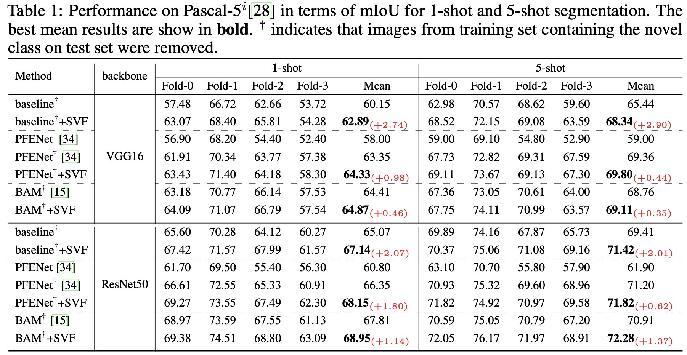
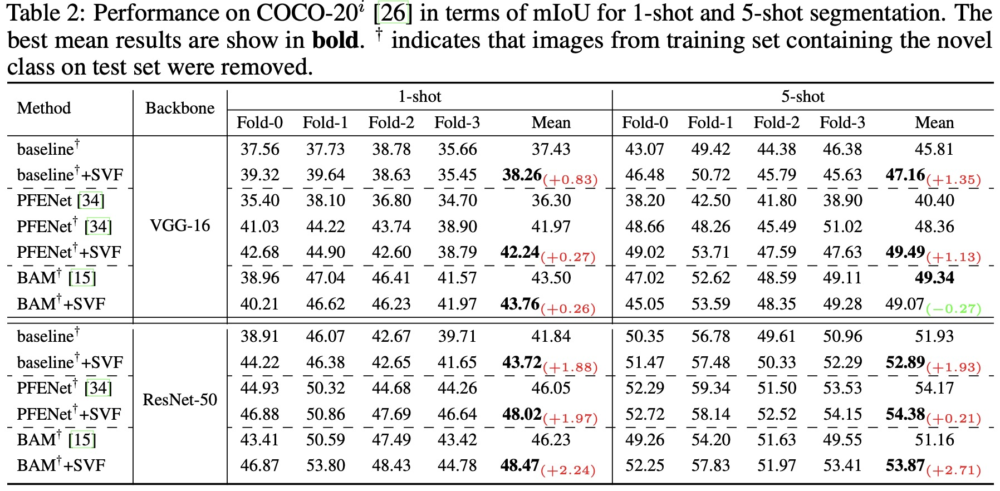

# Singular Value Fine-tuning: Few-shot Segmentation requires Few-parameters Fine-tuning
This is the official implementation of the paper [Singular Value Fine-tuning: Few-shot Segmentation requires Few-parameters Fine-tuning](https://arxiv.org/pdf/2206.06122.pdf).

Authors: Yanpeng Sun^, Qiang Chen^, Xiangyu He^, Jian Wang, Haocheng Feng, Junyu Han, Errui Ding, Jian Cheng, [Zechao Li](https://zechao-li.github.io/), Jingdong Wang

## Abstract
Freezing the pre-trained backbone has become a standard paradigm to avoid overfitting in few-shot segmentation. In this paper, we rethink the paradigm and explore a new regime: *fine-tuning a small part of parameters in the backbone*. We present a solution to overcome the overfitting problem, leading to better model generalization on learning novel classes. Our method decomposes backbone parameters into three successive matrices via the Singular Value Decomposition (SVD), then *only fine-tunes the singular values* and keeps others frozen. The above design allows the model to adjust feature representations on novel classes while maintaining semantic clues within the pre-trained backbone. We evaluate our *Singular Value Fine-tuning (SVF)* approach on various few-shot segmentation methods with different backbones. We achieve state-of-the-art results on both Pascal-5i and COCO-20i across 1-shot and 5-shot settings. Hopefully, this simple baseline will encourage researchers to rethink the role of backbone fine-tuning in few-shot settings.

 

## Introduction
we rethink the paradigm of freezing the pre-trained backbone and show that fine-tuning *a small part of parameters in the backbone* is free from overfitting, leading to better model generalization in learning novel classes. Our method is illustrated in Figure1(b). First, to find such a small part of parameters for fine-tuning, we decompose pre-trained parameters into three successive matrices via the Singular Value Decomposition (SVD). Second, we then *fine-tune the singular value matrices* and keep others frozen. The above design, called *Singular Value Fine-tuning (SVF)*, follows two principles: (i) maintaining rich semantic clues in the pre-trained backbone and (ii) adjusting feature map representations when learning to segment novel classes.

We evaluate our SVF on two few-shot segmentation benchmarks, Pascal-5$^i$ and COCO-20$^i$. Extensive experiments show that SVF is invulnerable to overfitting and works well with various FSS methods using different backbones. It is significantly better than the freezing backbone counterpart, leading to new state-of-the-art results on both Pascal-5i and COCO-20i.

## results

 
  
  

